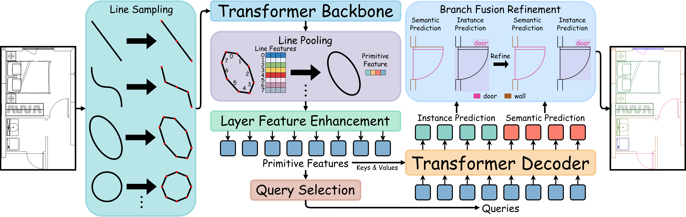

<div align="center">
    <h1>  Point or Line? Using Line-based Representation for Panoptic Symbol Spotting in CAD Drawings </h1>
    <div align="center">
        <a href='https://arxiv.org/abs/2505.23395'></a> &nbsp;&nbsp;&nbsp;&nbsp;
        <a href='http://home.weskwong.tech/releases/vecformer/'></a>
    </div>
    
</div>

## 🔥 News

- **[2025-09-18]** 🎉 Our work is accepted by NeurIPS 2025.

## 🛠️ Environment Setup

```bash
# Clone the repository
git clone https://github.com/WesKwong/VecFormer.git
cd VecFormer

# Create conda environment
conda create -n vecformer python=3.9 -y
conda activate vecformer

# Install torch
pip install torch==2.5.1 torchvision==0.20.1 torchaudio==2.5.1 --index-url https://download.pytorch.org/whl/cu118

# Install torch-scatter
pip install torch-scatter -f https://data.pyg.org/whl/torch-2.5.0+cu118.html

# Install flash-attention (we recommend building from source)
pip install packaging ninja
git clone https://github.com/Dao-AILab/flash-attention.git
cd flash-attention
MAX_JOBS=64 python setup.py install # Change `MAX_JOBS` to fit your machine
cd ..

# Install other requirements
pip install -r requirements.txt
```

## 📊 Data Preparation

### Download

In `VecFormer/`, run the following command to download the FloorPlanCAD dataset:

```bash
# Install gdown
pip install gdown

# Download the FloorPlanCAD dataset and unzip it
mkdir -p datasets && cd datasets
gdown "https://drive.google.com/uc?id=1wsOQxIXjsqYzMlUpPNRjyQiMnwgVbtJG"
unzip FloorPlanCAD.zip
cd ..
```

### Preprocess

In `VecFormer/`, run the following command to preprocess the data to json for training:

```bash
export PYTHONPATH=$(pwd):$PYTHONPATH
python data/floorplancad/preprocess.py \
    --input_dir=$(pwd)/datasets/FloorPlanCAD \
    --output_dir=$(pwd)/datasets/FloorPlanCAD-sampled-as-line-jsons \
    --dynamic_sampling \
    --connect_lines \
    --use_progress_bar
```

For point-style sampling, remove the `--connect_lines` arg:

```bash
export PYTHONPATH=$(pwd):$PYTHONPATH
python data/floorplancad/preprocess.py \
    --input_dir=$(pwd)/datasets/FloorPlanCAD \
    --output_dir=$(pwd)/datasets/FloorPlanCAD-sampled-as-point-jsons \
    --dynamic_sampling \
    --use_progress_bar
```

To visualize the sampled svgs, use arg `--save_type=svg`.

```bash
export PYTHONPATH=$(pwd):$PYTHONPATH
python data/floorplancad/preprocess.py \
    --input_dir=$(pwd)/datasets/FloorPlanCAD \
    --output_dir=$(pwd)/datasets/FloorPlanCAD-sampled-as-svgs \
    --dynamic_sampling \
    --save_type=svg
```

## 🚀 Quick Start

### Training & Evaluation

```bash
# Train the model
bash scripts/train.sh
# Evaluate the model
bash scripts/test.sh
```

By default, the script loads `${OUTPUT_DIR}/latest/checkpoint-best`. You can change the `resume_from_checkpoint` argument to test a specific checkpoint.

### Resuming Training

Sometimes the training process will crash mid-epoch. To resume training from a checkpoint:

```bash
bash scripts/resume.sh
```

By default, the script loads `${OUTPUT_DIR}/latest/checkpoint-best`. To specify a different checkpoint, you can change the `resume_from_checkpoint` argument.

**Note:** The `resume` mode preserves the optimizer state and continues training from where it left off.

### Continuing Training

To continue training from a checkpoint but start a **new** training run (resetting optimizer state):

```bash
bash scripts/continue.sh
```

**Note:** Different from `resume` mode, the `continue` mode loads checkpoint weights but resets the optimizer and starts a new training session.

## 🤝 Acknowledgements

Our work is built with reference to the following projects: [transformers](https://github.com/huggingface/transformers), [FloorPlanCAD](https://floorplancad.github.io/), [CADTransformer](https://github.com/VITA-Group/CADTransformer), [SymPoint V2](https://github.com/nicehuster/SymPointV2), [PointTransformer V3](https://github.com/Pointcept/PointTransformerV3).

Thanks for their excellent works!

## ⚖️ License

Our work is licensed under the [Apache License 2.0](LICENSE).

## 📖 Citation

```BibTex
@article{wei2025vecformer,
      title={Point or Line? Using Line-based Representation for Panoptic Symbol Spotting in CAD Drawings},
      author={Wei, Xingguang and Wang, Haomin and Ye, Shenglong and Luo, Ruifeng and Zhang, Yanting and Gu, Lixin and Dai,
      Jifeng and Qiao, Yu and Wang, Wenhai and Zhang, Hongjie},
      journal={arXiv preprint arXiv:2505.23395},
      year={2025}
}
```
